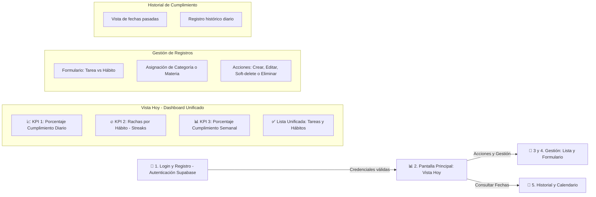
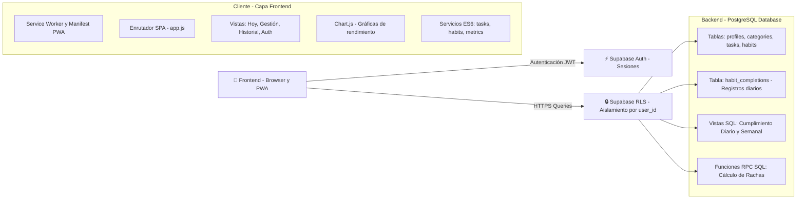

# ⚡ Pulso — Sistema Personal de Hábitos y Tareas

**Pulso** es un sistema inteligente y visual para la gestión diaria de estudio y productividad personal. Desarrollado con la filosofía de *"cero fricción y máximo enfoque"*, reemplaza las complejas tablas de Notion con una experiencia fluida, motivadora y basada en datos.

---

## 🎯 Problema y Solución

- **El problema:** Mantener listas tradicionales de tareas en Notion resulta tedioso, no ofrece visibilidad sobre el porcentaje real de avance diario ni semanal, y carece de incentivos visuales para mantener el ritmo.
- **La solución:** **Pulso** unifica tareas puntuales y hábitos diarios en una vista diaria inteligente ("Hoy"), calculando automáticamente métricas clave (porcentaje de cumplimiento, rachas o *streaks* e historial semanal) aisladas por usuario de forma segura.

---

## 🛠️ Stack Tecnológico

| Capa | Tecnología | Descripción |
| :--- | :--- | :--- |
| **Frontend** | Vanilla JavaScript (ES6 Modules) | Arquitectura modular nativa, ligera y sin frameworks pesados |
| **Estilos** | Vanilla CSS3 | Design system personalizado con variables CSS, modo oscuro y animaciones fluidas |
| **BaaS / Backend** | [Supabase](https://supabase.com/) | Autenticación, Base de datos PostgreSQL y Row Level Security (RLS) |
| **Métricas en Backend** | Supabase Views & RPC (SQL) | Cálculo de rachas e indicadores directamente en la base de datos |
| **Visualización** | Chart.js | Gráficas dinámicas de rendimiento diario y semanal |
| **Mobile / App** | Service Worker + Manifest (PWA) | Aplicación web progresiva instalable en móvil y escritorio |
| **Utilidades** | `date-fns` | Manipulación y formateo de fechas locales |

---

## 📂 Estructura del Proyecto

```text
pulso/
├── index.html              # Punto de entrada de la SPA
├── manifest.json           # Configuración PWA (instalabilidad)
├── sw.js                   # Service Worker para PWA
├── README.md               # Documentación principal del proyecto
├── checklist-pulso.md      # Ficha del proyecto y alcance original
├── assets/                 # Recursos estáticos
│   ├── icons/              # Iconos para PWA (192px, 512px)
│   └── favicon.ico         # Favicon
├── css/                    # Hojas de estilo organizadas
│   ├── main.css            # Design tokens, variables globales y reset
│   ├── components.css      # Componentes (botones, modales, cards, inputs)
│   └── pages.css           # Estilos específicos de cada vista
├── js/                     # Lógica frontend en ES Modules
│   ├── app.js              # Inicializador y enrutador principal
│   ├── config.js           # Configuración y cliente Supabase
│   ├── services/           # Capa de comunicación con Supabase
│   │   ├── auth.js         # Registro, Login y gestión de sesiones
│   │   ├── tasks.js        # CRUD de tareas
│   │   ├── habits.js       # CRUD y registros de hábitos
│   │   ├── categories.js   # Gestión de categorías/materias
│   │   └── metrics.js      # Consumo de indicadores y vistas SQL
│   ├── components/         # Componentes de interfaz de usuario
│   │   ├── navbar.js       # Barra de navegación
│   │   ├── chart.js        # Componente de gráficas con Chart.js
│   │   └── modals.js       # Modales de creación/edición
│   ├── pages/              # Controladores de vistas/pantallas
│   │   ├── auth.js         # Vista de Login y Registro
│   │   ├── today.js        # Vista unificada "Hoy" (Tareas + Hábitos)
│   │   ├── manage.js       # Vista de administración de tareas/hábitos
│   │   └── history.js      # Vista de Calendario / Historial
│   └── utils/              # Funciones auxiliares
│       ├── date.js         # Formateo y manipulación de fechas en zona local
│       └── dom.js          # Utilerías de renderizado y manipulación del DOM
└── supabase/               # Configuración SQL y backend
    ├── migrations/         # Scripts de estructura de BD
    │   └── 001_initial_schema.sql  # Tablas, políticas RLS, Vistas y RPC
    └── seed.sql            # Datos iniciales para pruebas
```

---

## 🗺️ Flujo de Pantallas y Experiencia de Usuario



---

## 🏗️ Arquitectura del Sistema



---

## 📐 Decisiones de Arquitectura y Diseño

1. **Aislamiento de Datos Multi-usuario (RLS):** 
   Aunque está pensado inicialmente para uso personal, el sistema es totalmente multi-usuario. La seguridad está garantizada a nivel de base de datos en Supabase usando *Row Level Security (RLS)*: ninguna cuenta puede leer ni alterar los registros de otra.

2. **Manejo de Fechas sin Desfase de Zona Horaria:**
   Las fechas de cumplimiento se determinan en el cliente según su hora local y se envían a la base de datos como tipo `DATE` (`YYYY-MM-DD`). Se evita derivar fechas desde el servidor para prevenir problemas de zona horaria (UTC vs Local).

3. **Registro Histórico de Hábitos sin Cron Jobs:**
   Cada cumplimiento de hábito se almacena como una entrada individual `(habito_id, fecha, completado)`. Esto elimina la necesidad de tareas programadas (cron jobs) para "reiniciar" los hábitos a medianoche: un nuevo día simplemente no tiene registro aún.

4. **Persistencia Histórica vs Limpieza:**
   - **Hábitos:** Utilizan *Soft-delete* (`archived_at`) para conservar el historial de racha (*streaks*) incluso si un hábito deja de practicarse.
   - **Tareas:** Permiten borrado físico (`DELETE`), ya que su ciclo de vida concluye al completarse.

5. **PWA Instalable (Web-First):**
   Incluye soporte PWA para comportarse como una aplicación nativa en dispositivos móviles y de escritorio. *(Requiere conexión a internet en v1)*.

---

## 📊 Criterios de Éxito e Indicadores

La pantalla principal de **Pulso** presenta tres métricas clave en tiempo real:

1. **Porcentaje Diario de Cumplimiento:** Medidor combinado del avance del día (Tareas + Hábitos).
2. **Rachas por Hábito (Streak):** Contador de días consecutivos cumplidos por cada hábito activo.
3. **Desempeño Semanal:** Porcentaje global de cumplimiento de la semana anterior para comparar el progreso continuo.

---

## 🚀 Próximos Pasos (Roadmap v1)

- [ ] Definición de esquema de base de datos y políticas RLS en `/supabase/migrations/`
- [ ] Maquetación del Design System e `index.html`
- [ ] Implementación de servicios Supabase (Auth + Client)
- [ ] Desarrollo de la vista unificada "Hoy" e integración de Chart.js
- [ ] Configuración del Service Worker y Manifest PWA

---

## 📄 Licencia

Desarrollado por **Carlos** como proyecto de portafolio personal.
